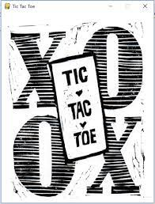

# Tic-Tac-Pygame

<p align="center">
  
</p>

## Introduction

Tic-Tac-Pygame is a simple two-player Tic-Tac-Toe game implemented in Python using the Pygame library. Players can choose 'X' and 'O', and the game is played on a graphical interface.

## Features

1. Two-player game.
2. Players can choose 'X' and 'O'.
3. Customizable 'X' and 'O' images (found in the `png` folder).
4. Graphical interface using Pygame.

## Setup

Before running the code, follow these steps:

1. Install the required packages using the `requirements.txt` file.

    ```bash
    pip install -r requirements.txt
    ```

2. Activate the virtual environment (assuming you have created one).

    ```bash
    source venv/bin/activate
    ```

## How to Play

Run the Python file `tic-tac.py` in your terminal to start and play the game.

## Customization

Feel free to customize the 'X' and 'O' images by replacing the files in the `png` folder.

## File Structure

```plaintext
tic-tac-pygame/
│
├── requirements.txt
│
├── tic-tac.py
│
├── png/
│   ├── x.png
│   └── o.png
│
└── README.md
